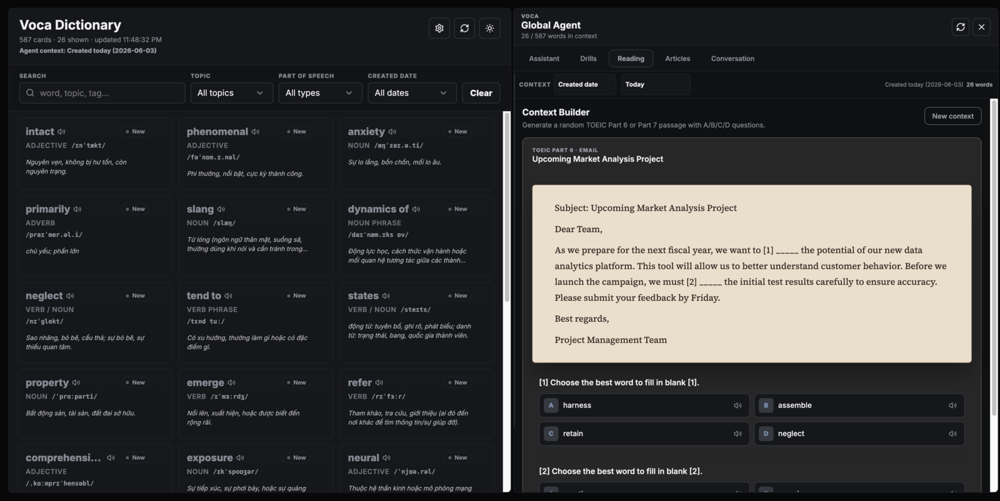
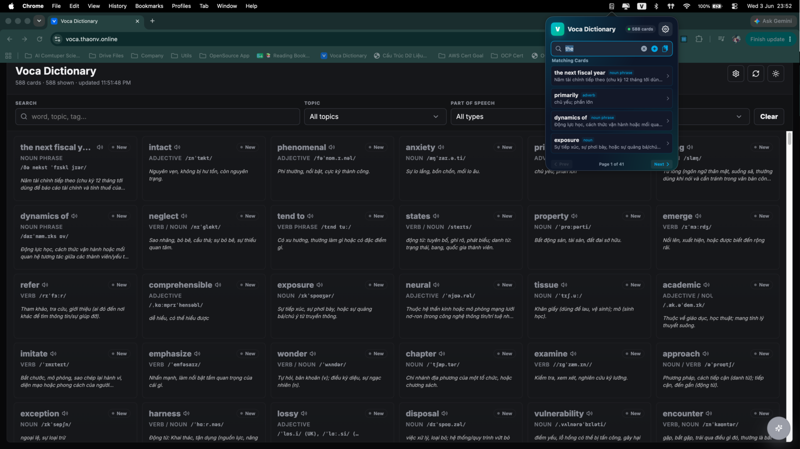
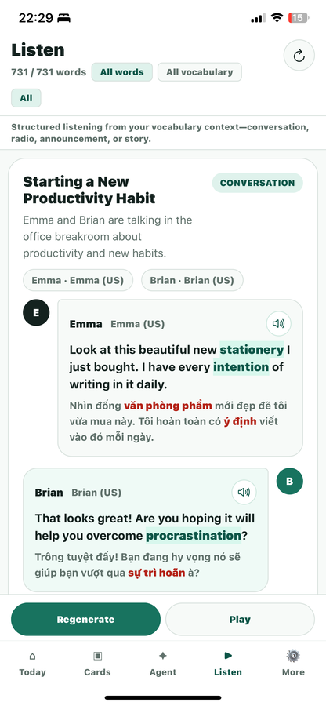
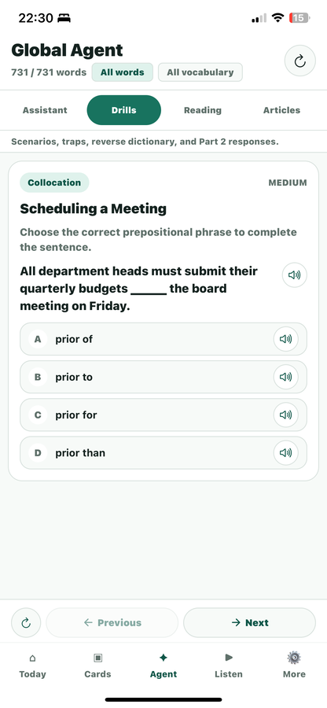
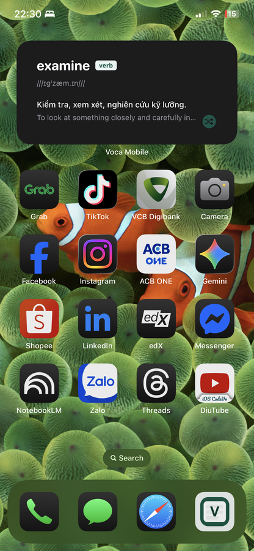

# Voca Dictionary v2

Ứng dụng học **từ vựng TOEIC** với spaced repetition (FSRS), phát âm (TTS) và trợ lý AI.
Bản viết lại **version 2.0**: multi-user, đồng bộ đám mây, **một binary / một port**, và **API cho bên thứ ba**.

- **Backend** — Spring Boot 3.4 (Java 21): gộp `voca` + `voca-bridge` thành **một app** duy nhất. Phục vụ luôn SPA đã build (không còn Node bridge / Playwright / sinh ảnh PNG).
- **Web** — React 19 + Vite 6 (PWA): **UI/UX giữ nguyên như v1**, chỉ thay tầng mạng sang backend mới (JWT, same-origin).

> Đây là dự án cá nhân. Trước đây đặt tạm trong repo v1 để tham chiếu; nay là repo độc lập.

## Ảnh chụp màn hình

### Web (Desktop)


*Lưới từ vựng (lọc/tìm kiếm, chi tiết thẻ) cạnh Global Agent — sinh bài đọc hiểu TOEIC Part 6/7 kèm câu hỏi A/B/C/D.*


*AI Agent toàn cục: trắc nghiệm (drills), luyện đọc/nghe hội thoại và trợ lý hỏi đáp.*

### Mobile

<p align="center">
  &nbsp;&nbsp;
  &nbsp;&nbsp;
  
</p>
<p align="center"><em>Từ trái qua phải: Danh sách & Tìm kiếm, Chi tiết thẻ, Global AI Assistant — ảnh từ app native (v2 iOS đang ở Phase 3).</em></p>

## Tính năng chính

- **Đa người dùng**: JWT (access + refresh, xoay vòng), bcrypt, vai trò `ADMIN`, seed admin lần đầu.
- **Từ điển & học tập**: danh sách/tìm kiếm thẻ, flashcard, đổi cấp độ, tạo thẻ bằng AI, phát âm.
- **SRS FSRS-5** tính phía server (stability/difficulty, thẻ đến hạn, thống kê).
- **Trợ lý AI (SSE streaming)**: hỏi đáp, quiz, sinh bài luyện tập (drills/reading) — build prompt phía client (`@voca/core`), stream qua `/api/chat/completions`.
- **API key tự phục vụ**: mỗi user tự tạo/thu hồi/xóa key để **hệ thống khác gọi vào `/v1`** với quyền của chính mình. Kèm **tài liệu API tải về được** (`/api/docs/v1` → Markdown).
- **Admin quản lý user**: liệt kê, đổi quyền admin, xóa (có guard chống xóa admin cuối / tự xóa).
- **Bí mật giữ server-side**: khóa LLM/TTS lưu theo user ở server, không bao giờ trả về trình duyệt.
- **PWA**: cài như app, có icon/favicon, service worker (`autoUpdate`).

## Cài đặt nhanh (bản release)

Tải **một file jar** (đã nhúng sẵn web + dữ liệu mẫu) rồi chạy. Yêu cầu: **Java 21+**. PostgreSQL sẽ được **tự dựng bằng Docker** (nếu máy có Docker), hoặc bạn tự chuẩn bị Postgres (`db=voca user=voca pass=voca` trên `:5432`). App chạy tại **http://localhost:22052**.

> Thay `OWNER/REPO` bằng repo GitHub của bạn.

**macOS / Linux**
```bash
REPO=OWNER/REPO
curl -fsSL "https://github.com/$REPO/releases/latest/download/install.sh" | sh -s -- "$REPO"
```

**Windows (PowerShell)**
```powershell
$env:VOCA_REPO="OWNER/REPO"
iwr "https://github.com/$env:VOCA_REPO/releases/latest/download/install.ps1" -UseBasicParsing | iex
```

**Thủ công (mọi OS có Java 21)** — nếu không muốn dùng script:
```bash
# 1) Postgres (nếu chưa có) — ví dụ bằng Docker:
docker run -d --name voca-db -e POSTGRES_USER=voca -e POSTGRES_PASSWORD=voca -e POSTGRES_DB=voca -p 5432:5432 postgres:16
# 2) Tải & chạy jar:
curl -fL "https://github.com/OWNER/REPO/releases/latest/download/voca.jar" -o voca.jar
java -jar voca.jar        # http://localhost:22052
```

Admin mặc định: `admin@voca.local` / `change-me`. Đổi port: `PORT=xxxx java -jar voca.jar`. DB khác: env `DB_URL`, `DB_USERNAME`, `DB_PASSWORD`.

*Bản release do **GitHub Actions** (`.github/workflows/release.yml`) tự build khi push tag `v*.*.*`.*

## Cấu trúc

```
voca-v2/
  backend/   Spring Boot 3.4 (Java 21) — 1 binary/1 port (22052), fat jar nhúng cả SPA
  web/       React 19 + Vite 6 + TypeScript (PWA) — client, UI/UX như v1
  ios/       SwiftUI native                                   [Phase 3 — chưa làm]
```

Hai vùng bảo mật trên cùng một port:
- `/v1/**` — API cho **bên thứ ba**, xác thực bằng **API key** (scope, rate-limit).
- `/api/**` — API cho **web/iOS** của người dùng cuối, xác thực bằng **JWT** (`/api/admin/**` cần `ROLE_ADMIN`).
- `/**` — còn lại (SPA, swagger, actuator).

---

## Chạy

### Yêu cầu
Java 21, Node 20+, PostgreSQL 16 (hoặc `docker compose` trong `backend/`).

### Dev (hot-reload)
```bash
# 1) Database
cd backend && docker compose up -d           # Postgres :5432

# 2) Backend (:22052)
./gradlew bootRun

# 3) Web (:5173, proxy /api & /v1 sang :22052)
cd ../web && npm install && npm run dev
```

### Production — MỘT binary, MỘT port
```bash
cd web && npm run build                        # → web/dist
cd ../backend && ./gradlew bootJar             # task copyWebApp tự nhúng web/dist vào jar
java -jar build/libs/voca-backend-2.0.0-SNAPSHOT.jar   # http://localhost:22052 phục vụ CẢ web + API
```

### Cấu hình
Env (tùy chọn) cho AI — hoặc mỗi user tự cấu hình key trong **Settings → Kết nối AI** (lưu server-side):
`VOCA_LLM_BASE_URL`, `VOCA_LLM_API_KEY`, `VOCA_LLM_MODEL`, `VOCA_TTS_BASE_URL`, `VOCA_TTS_API_KEY`.

Admin mặc định: `admin@voca.local` / `change-me` (đổi qua `VOCA_ADMIN_EMAIL`, `VOCA_ADMIN_PASSWORD`).
JWT access TTL mặc định 12h (`VOCA_JWT_ACCESS_TTL`, giây).

---

## API

### Public / bên thứ ba — `/v1/**`
Header `X-API-Key: voca_…` **hoặc** `Authorization: Bearer voca_…`. Tài liệu đầy đủ + ví dụ tải tại
**Settings → API Keys → Tải tài liệu API (.md)** (endpoint `GET /api/docs/v1`).

| Method | Path | Scope |
|---|---|---|
| GET | `/v1/health` | — |
| GET | `/v1/cards` (`?ifChangedSince=`) | cards:read |
| GET | `/v1/cards/lookup?word=` | cards:read |
| GET | `/v1/cards/{slug}` | cards:read |
| POST | `/v1/cards/create` | cards:create |
| GET/POST | `/v1/audio/{id}` | audio:read |
| POST | `/v1/practice/{drills,reading}` (SSE) | practice:generate |

### App — `/api/**` (`Authorization: Bearer <jwt>`)

| Nhóm | Endpoint |
|---|---|
| Auth | `POST /api/auth/{register,login,refresh,logout}` · `GET /api/auth/me` |
| Cards | `GET/POST /api/cards` · `GET/DELETE /api/cards/{slug}` · `PATCH /api/cards/{slug}/level` · `POST /api/cards/create` · `POST /api/cards/fill-meanings` |
| Học tập | `POST /api/review` · `GET /api/study/due` · `GET /api/study/stats` |
| AI | `POST /api/chat/completions` (SSE) · `POST /api/tts` · `GET/POST /api/audio/{id}` |
| Settings | `GET/PUT /api/user/settings` (khóa LLM/TTS server-side) |
| **API key (tự phục vụ)** | `GET /api/user/api-keys` · `POST /api/user/api-keys` · `POST /api/user/api-keys/{id}/revoke` · `DELETE /api/user/api-keys/{id}` |
| **Tài liệu API** | `GET /api/docs/v1` → Markdown (tải về) |
| **Admin — users** | `GET /api/admin/users` · `PATCH /api/admin/users/{id}` · `DELETE /api/admin/users/{id}` (ROLE_ADMIN) |
| Admin — API clients | `/api/admin/api-clients` · `/api/admin/api-clients/{id}/keys` · `/api/admin/api-keys` (ROLE_ADMIN) |

OpenAPI/Swagger: `/swagger-ui.html`, `/v3/api-docs`.

---

## Web (client)

React 19 + Vite 6 + TypeScript, **PWA** (`vite-plugin-pwa`). **UI/UX giữ đúng như v1**: tái sử dụng
nguyên `styles.css` / `theme-colors.css` và DOM của v1 (theme "inkwell" ink-on-paper, font Source Serif 4
cho headword); chỉ thay tầng mạng để gọi backend Spring Boot (same-origin `/api`, `/v1`, JWT tự refresh).

- **Auth gate**: `LoginPage`; JWT lưu qua `zustand` (persist `voca-auth`).
- **Từ điển**: grid tìm kiếm/lọc, flashcard (hiện nghĩa trực tiếp), phát âm, tạo thẻ bằng AI.
- **Global Agent** (SSE): Assistant/Drills/Reading/Articles/Conversation.
- **Settings** (dialog dạng tab, **một size cố định**): Kết nối AI · Giọng đọc · Học tập · **API Keys**
  (endpoint + tạo/thu hồi/xóa key + tải tài liệu API) · **Người dùng** (admin) · Nâng cao.
- **Icon/Favicon**: `web/public/` — `favicon.svg`, `favicon.ico`, `apple-touch-icon.png`,
  `pwa-192/512`, `maskable-512` (khai báo trong `vite.config.ts`).

---

## Còn lại (roadmap)

- iOS SwiftUI (Phase 3) — gen client Swift từ OpenAPI.
- Mã hoá at-rest cho khóa trong `user_settings` (hiện lưu plaintext ở server, không trả về client).
- Rate-limit phân tán (Bucket4j + Redis) cho triển khai nhiều instance.
- Unit test FSRS + integration test (Testcontainers đã sẵn deps).
